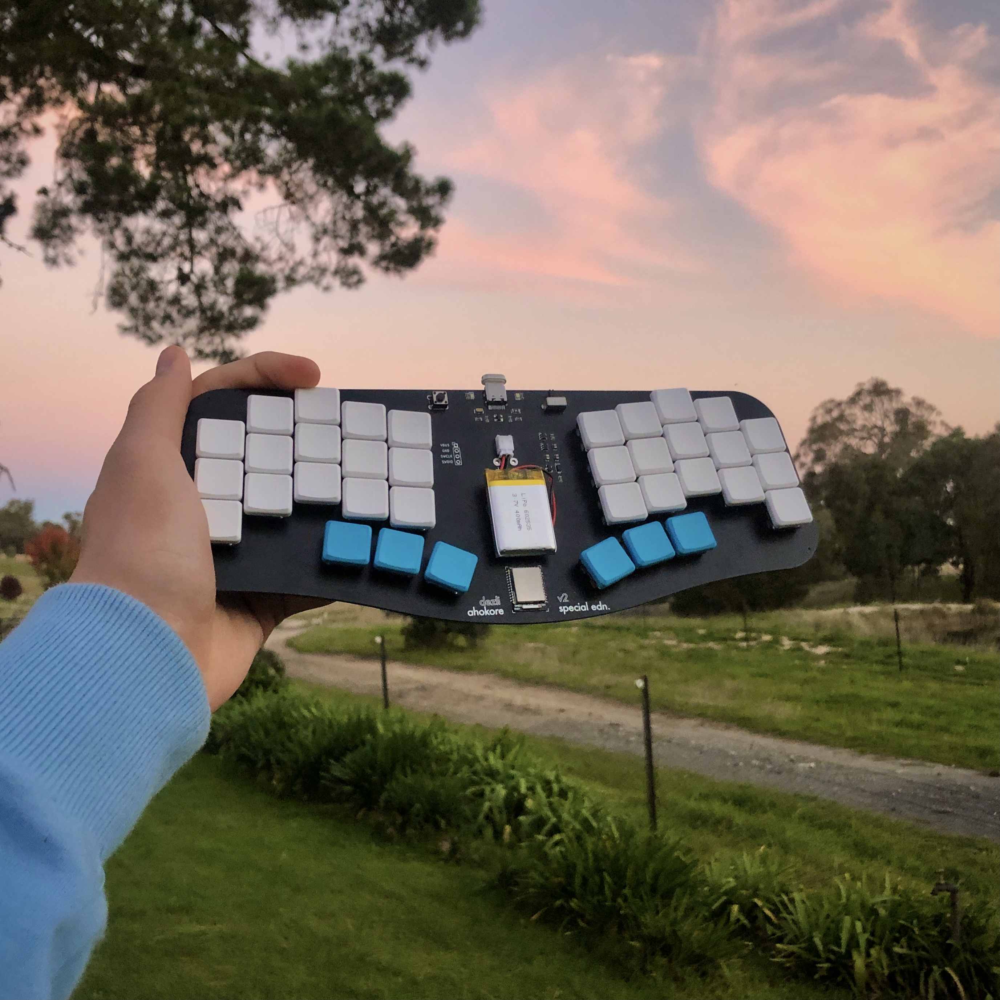

  # ahokore

Ahokore is a 36-key one-piece split keyboard, with full wireless functionality. Stagger is copied from the Ferris, as I found that very comfortable. The name is "wireless" translated into Maori.

V1 is tested to be fully working, and uses a nice!nano.

<<<<<<< HEAD
V2 protypes have been ordered, and will be soon tested.
=======
V2 protypes have been tested, and are fully working. Group buy is planned. 
>>>>>>> 7e9c9095d8836a47d2fe740e251c91163cb1ada8

All work in this repository is released into the public domain. See the license file for more details!
